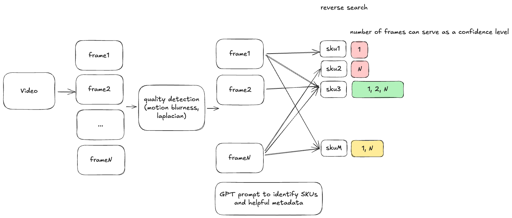

## Shelf Video → SKU Catalog Onboarding



This project turns in-store shelf videos into a structured product catalog. It finds the sharpest frames from a video, then uses a multimodal LLM (gpt-5 via DoorDash GenAI Gateway) to identify unique SKUs, pricing, and useful packaging text for catalog matching.

### Who this is for
- Business stakeholders who want a fast, low-touch way to onboard local stores into a marketplace/catalog.
- Engineers who want a robust, repeatable pipeline that can run on raw shelf videos and produce machine-usable outputs.

### What you get
- A run folder with:
  - Sharp frames extracted from the video.
  - A per-frame metrics CSV.
  - An LLM-produced SKU-level CSV suitable for downstream catalog matching.
  - A detailed analysis log with real-time progress and ETA.


## How it works (end-to-end)
1. Video ingestion (MOV/MP4): process the first N seconds (or the entire video) frame-by-frame.
2. High-quality frame selection: compute multiple focus metrics, then keep only the sharpest frames while avoiding near-duplicates.
   - Laplacian variance (edge detail)
   - Tenengrad mean (gradient magnitude)
   - Contrast (intensity stdev)
   - Brightness gating (discard too dark/bright frames)
   - Top-percentile selection + temporal non-maximum suppression (min time gap)
3. SKU extraction via LLM:
   - Each selected frame is base64-encoded and sent to gpt-5 through the GenAI Gateway (Portkey).
   - The prompt instructs the model to extract unique SKUs, names (brand, product, size), prices (full/discounted), taxonomy, and free-form text.
   - Responses are parsed as strict JSON and written to a consolidated CSV.
4. Output artifacts are saved under `outputs/<video>_first<seconds>s_<timestamp>/`.


## Key features
- Sharpness-based sampling for OCR/recognition-friendly frames.
- De-duplication across time to avoid near-identical frames.
- Strict JSON schema for SKU outputs; robust parsing of model responses.
- Real-time progress, rate, and ETA during both extraction and analysis.
- Concurrency and image downscaling to significantly reduce LLM latency and cost.


## Requirements
- macOS/Linux, Python 3.9+
- Packages: `opencv-python`, `numpy`, `portkey-ai`
- DoorDash GenAI Gateway credentials
  - `PORTKEY_API_KEY` – API key
  - `OPENAI_VIRTUAL_KEY` – virtual key (OpenAI provider)


## Setup
```bash
python3 -m venv .venv
source .venv/bin/activate
pip install --upgrade pip
pip install opencv-python numpy portkey-ai

# Required env vars
export PORTKEY_API_KEY="<your_portkey_api_key>"
export OPENAI_VIRTUAL_KEY="<your_openai_virtual_key>"

# Optional overrides
export PORTKEY_BASE_URL="https://cybertron-service-gateway.doordash.team/v1"
export OPENAI_MODEL="gpt-5"                  # use gpt-5 by default
export ANALYSIS_CONCURRENCY="6"              # concurrent LLM calls
export SEND_MAX_WIDTH="1024"                 # downscale width for upload
export SEND_JPEG_QUALITY="80"                # JPEG quality for upload
```


## Quick start
### 1) Extract sharp frames (first 120 seconds)
```bash
python script.py \
  --video "/Users/<you>/Downloads/TNT_Asian_Market.mov" \
  --limit-seconds 120 \
  --out-dir ./outputs \
  --min-gap 0.5 \
  --top-percent 15
```

You’ll see real-time extraction progress and a summary when done. Outputs:
- Frames: `outputs/TNT_Asian_Market_first120s_<timestamp>/frames/`
- Metrics CSV: `outputs/TNT_Asian_Market_first120s_<timestamp>/frame_metrics.csv`

Tips:
- To process the full video, set `--limit-seconds 0`.
- To save fewer/more frames, adjust `--top-percent` and `--min-gap`.

### 2) Analyze frames with gpt-5 (SKU CSV)
```bash
python script.py \
  --analyze-frames-dir ./outputs/TNT_Asian_Market_first120s_<timestamp>/frames \
  --analysis-csv ./outputs/TNT_Asian_Market_first120s_<timestamp>/sku_analysis_gpt5.csv \
  --model ${OPENAI_MODEL:-gpt-5} \
  --concurrency ${ANALYSIS_CONCURRENCY:-6} \
  --send-max-width ${SEND_MAX_WIDTH:-1024} \
  --send-jpeg-quality ${SEND_JPEG_QUALITY:-80}
```

You’ll see real-time analysis progress: processed/total, successes/failures, rows written, rate (fps), and ETA. A log can be captured with `2>&1 | tee analysis_gpt5.log`.


## Outputs and data schema
Each run creates a timestamped directory under `outputs/`. Important files:
- `frames/` – selected sharp frames (`frame_0001234.jpg`)
- `frame_metrics.csv` – per-frame measures and selection flag
- `sku_analysis_*.csv` – consolidated SKU rows from LLM

SKU CSV columns:
- `frame_index` – frame number in the original video
- `frame_path` – absolute path to the saved frame
- `sku_index` – 1-based index of unique SKU within the frame (deduplicated)
- `name` – brand, product name, size (e.g., “Coca-Cola Zero Sugar 12oz 12-Pack”)
- `price_full` – pre-discount price if legible
- `price_discounted` – discounted price if shown
- `taxonomy` – e.g., “Beverages > Soda”
- `other_text` – helpful free-form text from packaging/shelf tags for catalog matching


## Prompt (used for LLM extraction)
The prompt guides gpt-5 to output strict JSON only, with the schema shown above, to ensure reliable parsing. It emphasizes:
- De-duplication of identical items in the same frame.
- Preference for exact prices if legible; cautious inference otherwise.
- Compact taxonomy; best-effort classification when uncertain.
- Contiguous `sku_index` starting at 1.


## Performance and cost controls
- Concurrency: `--concurrency` (env: `ANALYSIS_CONCURRENCY`) to parallelize LLM calls.
- Upload size: `--send-max-width` and `--send-jpeg-quality` reduce payload size and latency.
- Frame selection: `--top-percent` and `--min-gap` control how many frames are analyzed.
- Partial runs: use `--max-frames` during analysis to validate before scaling up.


## Technical notes (focus metrics)
- Laplacian variance: high-frequency energy; higher → sharper.
- Tenengrad mean: Sobel gradient magnitude; complements Laplacian.
- Contrast (stdev): global contrast proxy.
- Brightness gating: drop frames too dark/bright for OCR.
- Robust z-scoring and weighted combination with percentile thresholding.
- Temporal NMS via minimum time gap to avoid near-duplicates.


## Customization
- Tweak selection thresholds (`--top-percent`, `--min-gap`).
- Change extraction resize for metrics (`--resize-max-width`).
- Swap or extend taxonomy logic (post-processing step on the CSV). 
- Integrate OCR for price parsing fallback (e.g., Tesseract/Craft/DBNet) if needed.


## Limitations and next steps
- Prices may be ambiguous if shelf tags are partially occluded; consider OCR-assisted price parsing.
- Cross-frame SKU de-duplication is not implemented; add a post-pass to unify global SKUs across frames.
- Optional product cropping and gallery generation can be added by detecting bounding boxes.
- Add store-region heuristics for price currency and brand normalization.


## Troubleshooting
- Missing creds: ensure `PORTKEY_API_KEY` and `OPENAI_VIRTUAL_KEY` are exported.
- Slow analysis: increase `--concurrency`, reduce `--send-max-width`, or raise `--top-percent` down (fewer frames).
- Parsing errors: responses are auto-sanitized; if persistent, lower concurrency or try again.


## Repository structure
```
smb_onboarding/
  script.py         # extraction + analysis CLI
  README.md         # this guide
  outputs/          # run artifacts (created per run)
```


## Example: full video, concurrent gpt-5 analysis
```bash
rm -rf ./outputs
python script.py \
  --video "/Users/<you>/Downloads/TNT_Asian_Market.mov" \
  --limit-seconds 0 \
  --out-dir ./outputs \
  --min-gap 0.5 \
  --top-percent 15

LATEST_RUN=$(ls -dt ./outputs/TNT_Asian_Market_first0s_* | head -1)
python script.py \
  --analyze-frames-dir "$LATEST_RUN/frames" \
  --analysis-csv "$LATEST_RUN/sku_analysis_gpt5.csv" \
  --model gpt-5 \
  --concurrency 6 \
  --send-max-width 1024 \
  --send-jpeg-quality 80 2>&1 | tee "$LATEST_RUN/analysis_gpt5.log"
```


